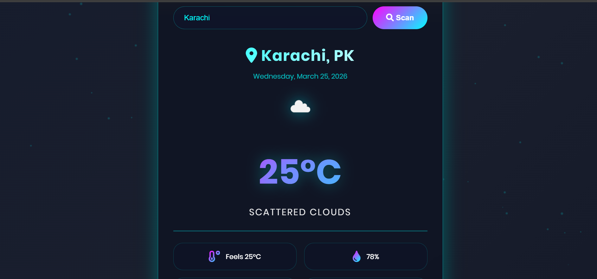

# 🌌 Nebula Weather

A modern, fully responsive weather application with a stunning cyberpunk/neon theme.

## ✨ Features
- 🌍 Real-time weather data from OpenWeatherMap API
- 📅 5-day weather forecast
- 🎨 Cyberpunk neon UI with glassmorphism effect
- ✨ Floating particles animation
- 📱 Fully responsive (mobile, tablet, desktop)
- 🔍 Search any city worldwide
- ⌨️ Enter key support

## 🛠️ Technologies Used
- HTML5
- CSS3 (Flexbox, Grid, Animations)
- JavaScript (ES6+)
- OpenWeatherMap API
- Font Awesome Icons

## 🚀 Live Demo
[View Live](https://nebula-weather.netlify.app)

## 📸 Screenshot

## 📁 Project Structure